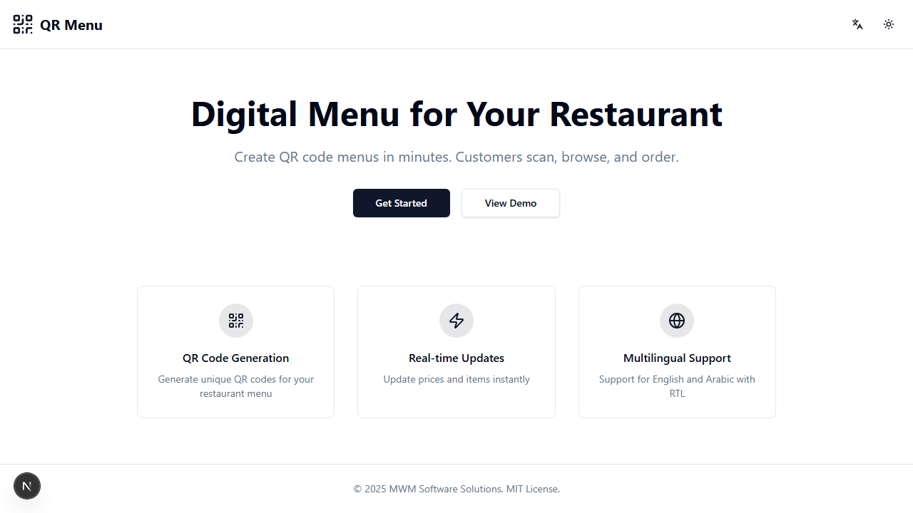
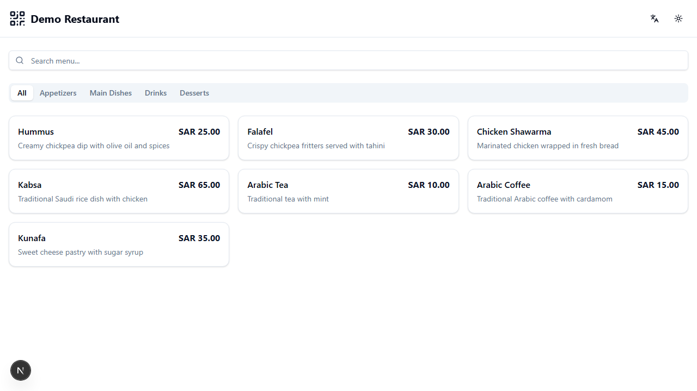
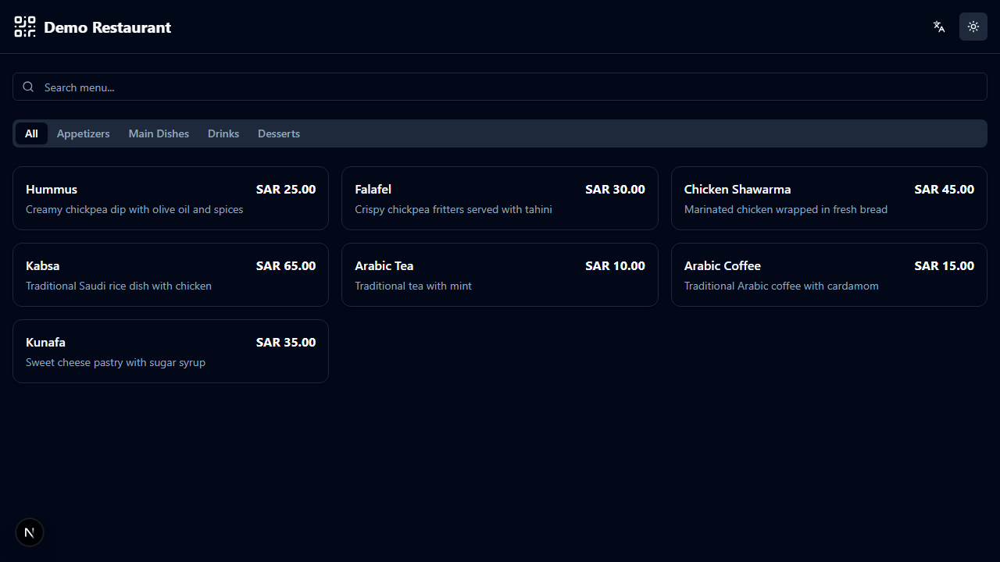
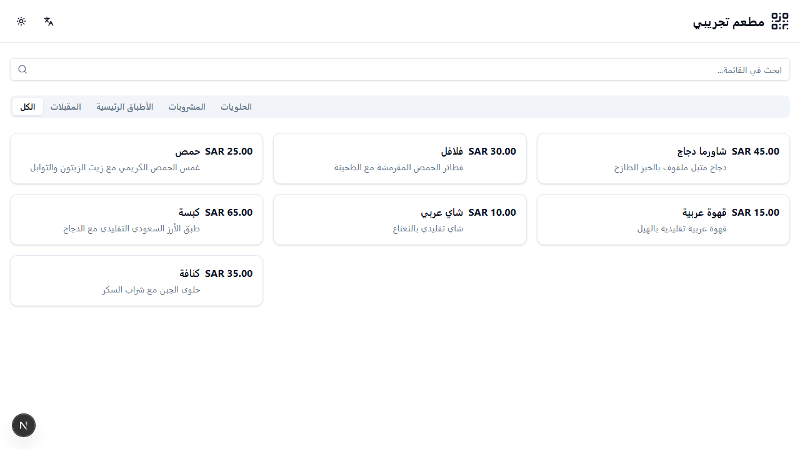
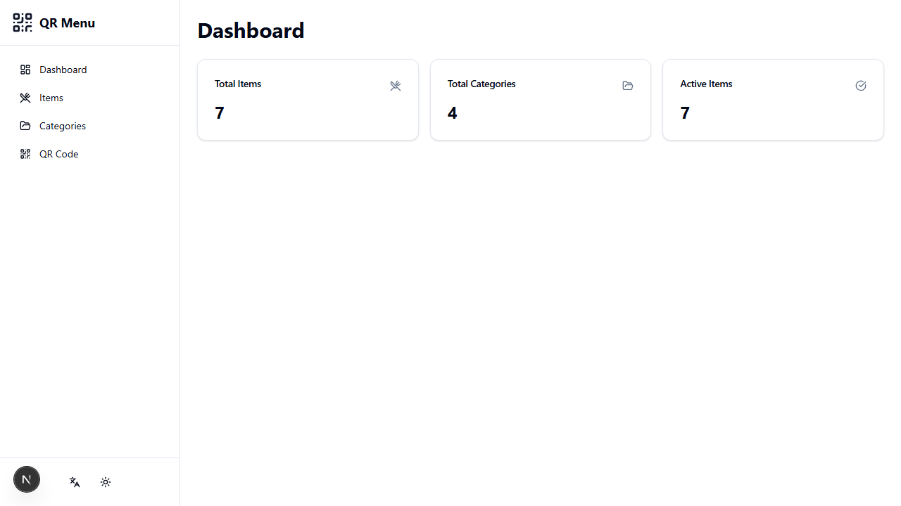
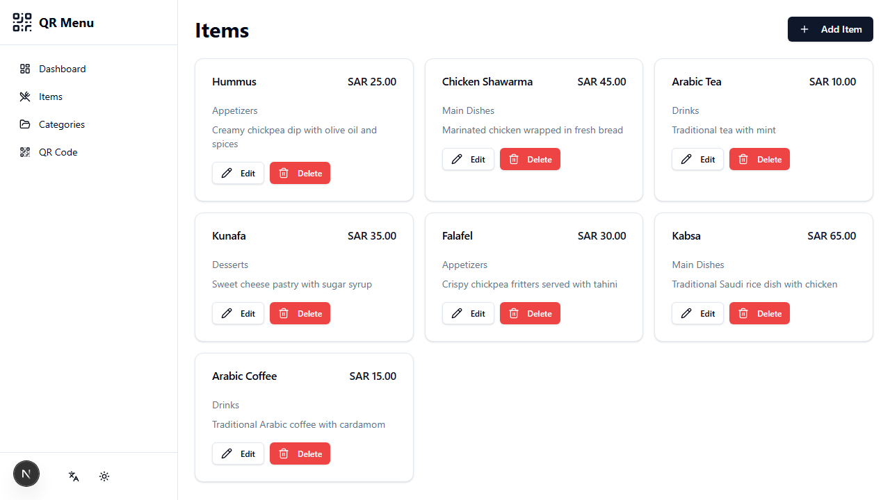
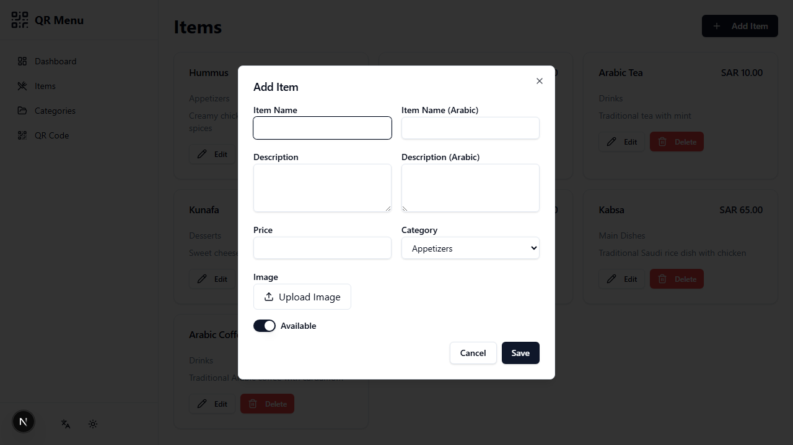
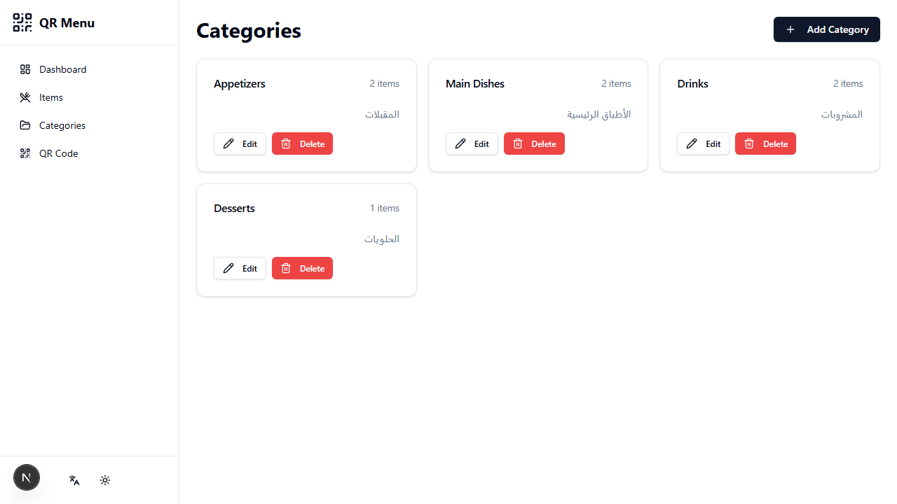
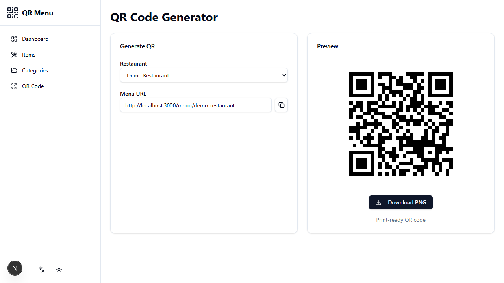
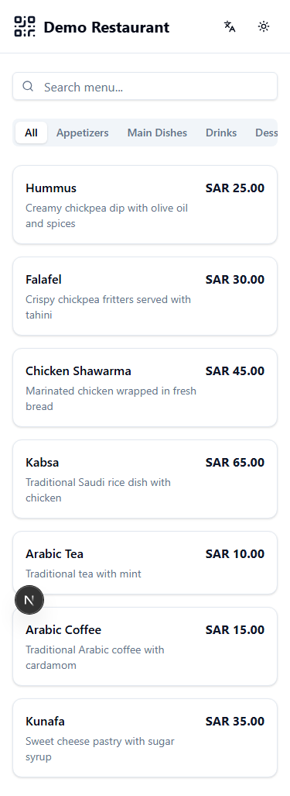

# QR Menu - Digital Restaurant Menu

Scan QR. View Menu. See Prices (Live!)

## Features

- Mobile-first digital menu
- Items with images
- Real-time price updates
- Search & categories
- QR code generator
- Arabic & English with RTL support
- Dark/Light mode

## Screenshots

### Landing Page


### Menu Page


### Dark Mode


### Arabic (RTL)


### Admin Dashboard


### Admin - Manage Items


### Admin - Add Item Dialog


### Admin - Categories


### Admin - QR Code Generator


### Mobile View


## Quick Start

### Using Docker

```bash
docker run -p 3000:3000 mwmsoftware/qr-menu
```

### Local Development

```bash
# Clone the repository
git clone https://github.com/mahmoodhamdi/QR-Menu.git
cd QR-Menu

# Install dependencies
npm install

# Setup database
npx prisma db push
npm run db:seed

# Start development server
npm run dev
```

Open [http://localhost:3000](http://localhost:3000)

## Tech Stack

- **Framework**: Next.js 14 (App Router)
- **Language**: TypeScript
- **Styling**: Tailwind CSS + shadcn/ui
- **Database**: Prisma + SQLite
- **i18n**: next-intl (English/Arabic)
- **Testing**: Vitest + Playwright

## Project Structure

```
src/
├── app/
│   ├── [locale]/           # i18n routes
│   │   ├── page.tsx        # Landing page
│   │   ├── menu/[slug]/    # Public menu
│   │   └── admin/          # Admin dashboard
│   └── api/                # API routes
├── components/
│   ├── menu/               # Menu components
│   ├── admin/              # Admin components
│   └── ui/                 # shadcn components
├── lib/                    # Utilities
└── messages/               # i18n translations
```

## Routes

| Route | Description |
|-------|-------------|
| `/` | Landing page |
| `/menu/[slug]` | Public menu (customers scan QR) |
| `/admin` | Admin dashboard |
| `/admin/items` | Manage menu items |
| `/admin/categories` | Manage categories |
| `/admin/qr` | Generate & download QR |

## API Endpoints

```
GET    /api/health              # Health check
GET    /api/restaurants         # List restaurants
GET    /api/restaurants/[slug]  # Get restaurant + menu
POST   /api/categories          # Add category
PATCH  /api/categories/[id]     # Update category
DELETE /api/categories/[id]     # Delete category
POST   /api/items               # Add item
PATCH  /api/items/[id]          # Update item
DELETE /api/items/[id]          # Delete item
POST   /api/upload              # Upload image
```

## Scripts

```bash
npm run dev        # Development server
npm run build      # Production build
npm run start      # Start production server
npm run test       # Run unit tests
npm run test:e2e   # Run E2E tests
npm run lint       # Linting
npm run db:push    # Push database schema
npm run db:seed    # Seed database
npm run db:studio  # Open Prisma Studio
```

## Environment Variables

Create a `.env` file:

```env
DATABASE_URL=file:./data/menu.db
NEXT_PUBLIC_APP_URL=http://localhost:3000
UPLOAD_DIR=./uploads
```

## Docker

```bash
# Build image
docker build -t qr-menu .

# Run container
docker run -p 3000:3000 -v qr-data:/app/data qr-menu
```

## Contact

- Email: mwm.softwars.solutions@gmail.com
- Email: hmdy7486@gmail.com
- Phone: +201019793768

## License

MIT License - see [LICENSE](LICENSE)
